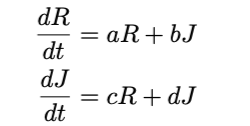

# 2024-AW-Simulation-Engineering
シミュレーション工学の授業内で使うコード

## TODO

### 課題1-1

- [ ] オイラー法の実装 
- [ ] Runge-Kutta 法の実装
- [ ] 上の実装が完了したら、最適と思われる刻み幅を見つける。(ライブラリ等は使わない)
- [ ] シミュレーション時間T 、システムパラメータa, b, c, d、初期値R(0), J(0) を変更してシミュレーションを実行できるようにプログラムを作成する
- [ ] t-R(t)グラフを作成
- [ ] t-J(t)グラフを作成
- [ ] 横軸をR、縦軸をJ として時間変化に伴う状態ベクトル(R, J) の軌道を表示するグラフを作成する 

### 課題1-2
- [ ] 課題1-1でやったようなことを1-3節の場合分けに応じてパラメータを設定し実行する
*シミュレーションの実行前に結果を予測すること*
    - [ ] a = d = 0, b, c > 0の場合
    - [ ] a = d = 0, b, c < 0の場合
    - [ ] a = d = 0, b*c < 0の場合
- [ ] それぞれの場合に対して(R, J)を時間微分した($\frac{dR}{dt}, \frac{dJ}{dt}$)のベクトル場のグラフを作成(quiver関数)